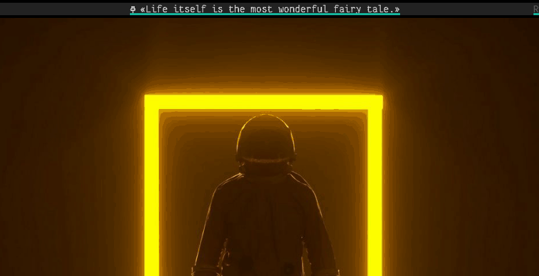

# 📚 polybar-quotation

This polybar module reads file with famous quotations and shows them on bar.
You can also truncate quotation.


  
- *Single line quote*  

  
- *Multi line quote*  

  
- *Scrolling quote*  


## Dependencies
You only need to install this 

- [jq](https://www.archlinux.org/packages/community/x86_64/jq/)
- [zscroll](https://aur.archlinux.org/packages/zscroll-git/)

## Configuration

- **active_record** - name of file with currently visible quote.
- **line_max_length** - maximal characters visible at the screen.
- **separator** - separates quote and author.
- **left_quote, right_quote** - chars that wraps citation. 
- **alt_left_quote, alt_right_quote** - chars that wraps author's name.

## Installation

- Clone repository
  ```sh
  git clone https://github.com/pikulo-kama/polybar-quotation
  ```
- Move files to polybar scripts
  ```sh
  mv -r polybar-quotation/ ~/.config/polybar/scripts/
  ```
- Add this line to ```~/.config/i3/config``` file
  ```sh
  exec_always --no-startup-id $HOME/.config/polybar/scripts/polybar-quotation/quot.py --random 
  ```
- Open ```hooks.sh``` and change bar name to yours
  ```sh
  bar_name="Your bar name"
  ```
 - Install fonts from ```fonts``` directory (Optional)
 
## Module


  Make sure you have ipc enabled in your bar, if not add this line to ```[bar/name]``` section
  ```ini 
  enable-ipc = true
  ```
  
  If you installed fonts then add this line to your ```[bar/name]``` section
  ```ini 
  font-2 = "Iconic Pictograms Bold:size=11;4"
  ```
  
  **NOTE:** if you want to change quote just restart your i3wm (```$mod+shift+r```)  
  

### You can install two versions of module with ```toggle``` or ```scroll``` behaviour. 
- ```Toggle version``` 

  ```ini
  [module/quotation]
  type = custom/ipc
  hook-0 = ~/.config/polybar/scripts/polybar-quotation/quot.py --current-line
  hook-1 = ~/.config/polybar/scripts/polybar-quotation/quot.py --author

  initial = 1

  click-left = ~/.config/polybar/scripts/polybar-quotation/hooks.sh 1
  click-right = ~/.config/polybar/scripts/polybar-quotation/hooks.sh 2

  format-font = 3
  format-prefix = "Y  "
  format-underline = #15b39b

- ```Scroll version``` 
  ```ini
  [module/scroll-quote]
  type = custom/script
  tail = true
  exec = ~/.config/polybar/scripts/polybar-quotation/scroll_quote.sh

  format-font = 3
  format-prefix = "Y  "
  format-underline = #15b39b
  ```

  ```ini
  [module/quote-control]
  type = custom/ipc
  hook-0 = echo %{T3} "U" %{T-}
  hook-1 = echo %{T3} "L" %{T-}

  initial = 2

  click-left = ~/.config/polybar/scripts/polybar-quotation/quot.py --swap
  ```
  
  
